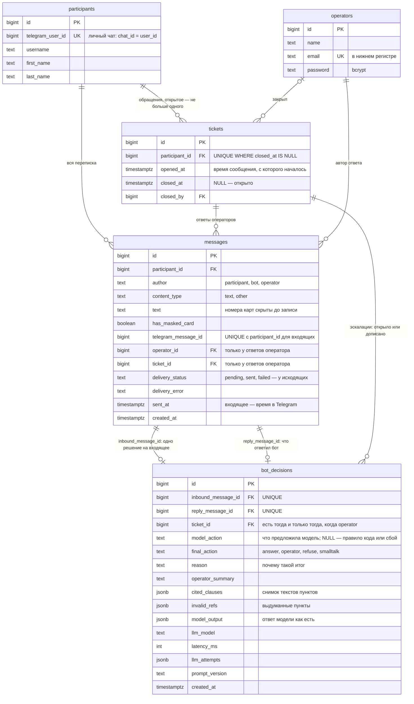

# Схема базы данных

Статус: черновик на согласовании, миграций ещё нет. PostgreSQL 18. Всё время хранится в `timestamptz(6)` в UTC; в МСК переводим только при показе и при расчёте сроков и розыгрышей.

## Таблицы

- `operators` — операторы панели. Отдельная таблица вместо `users`: участники — это не пользователи панели. Первый оператор создаётся из `.env` при старте.
- `participants` — участники, написавшие боту (только личные чаты).
- `tickets` — обращения к операторам. Статус выводится из `closed_at`; закрытое обращение не переоткрывается: если человек напишет снова и понадобится оператор, откроется новое.
- `messages` — вся переписка: участник, бот, оператор. Из неё строятся история для оператора и контекст для модели; у исходящих хранится статус доставки.
- `bot_decisions` — журнал решений бота: ровно одно решение на каждое входящее сообщение. Что предложила модель, что сделал бот и почему, на какие пункты опирался (с их текстом), какая модель, сколько думала. Из этого журнала считается статистика.
- Служебные таблицы Laravel: `sessions`, `cache`, `cache_locks`, `jobs`, `failed_jobs`, `migrations`.

## Почему так

- **Одно открытое обращение** закреплено в самой базе частичным уникальным индексом `tickets (participant_id) WHERE closed_at IS NULL`. Новое обращение открывается через `INSERT … ON CONFLICT DO NOTHING`, так что даже при гонке второе не появится.
- **Бот не отвечает дважды.** Защита в три слоя: дубль от Telegram отсекает уникальный индекс `(participant_id, telegram_message_id)` у входящих; на одно входящее — одно решение (UNIQUE); у решения — один ответ (UNIQUE).
- **Журнал решений — единственный источник статистики и ответа на вопрос «что бот ответил и почему».** Отдельной таблицы счётчиков нет, поэтому рассинхронизироваться нечему. Определения статистики можно менять без миграций.
- **«Бот не выдумывает» проверяется и в базе.** CHECK не даст записать `answer` без проверенных пунктов или с выдуманными, а `operator` — без обращения. Тексты процитированных пунктов сохраняются снимком: оператор видит, на что опирался бот, даже если правила потом поправят.
- **Время не съезжает.** `timestamptz(6)`, сессия базы в UTC. Даты уходят в базу с явным смещением (своя грамматика pgsql для Laravel), поэтому московское время не превращается в UTC со сдвигом на 3 часа. Это закреплено тестом.
- **Номера карт скрываются до записи.** Ни одна колонка их не содержит, сырые апдейты Telegram не хранятся. В очередь уходит только id сообщения, а не текст.
- **Без дублирования состояния.** Нет `status`, `last_*_at` и счётчиков: «ждёт ответа с», «время первого ответа» и статус обращения выводятся запросами. Связь «входящее → обращение» хранится только в решении.
