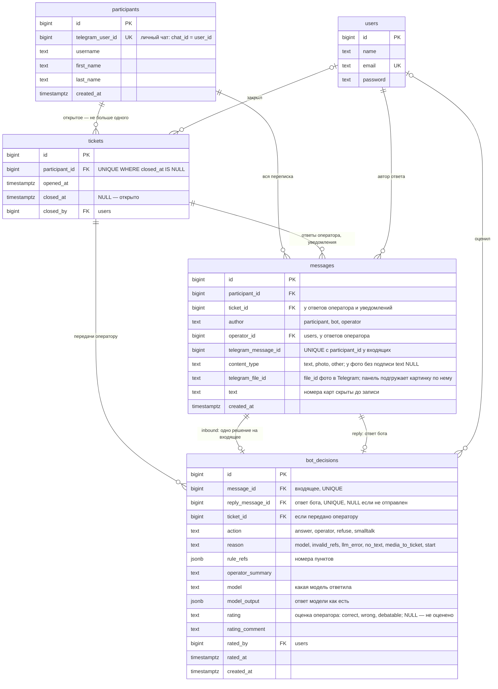

# Схема базы данных

Статус: реализовано на шаге 1 (`database/migrations/2026_10_01_000000_create_promo_tables.php`); фото и оценки операторов добавлены доработкой после шага 5, 01.10.2026 (`…_000001_add_photo_file_and_ratings.php`). PostgreSQL 18. Всё время в `timestamptz` (UTC); в МСК переводим при показе и при расчёте сроков и розыгрышей.

Служебные таблицы Laravel из стандартных миграций: `sessions`, `cache`, `cache_locks`, `jobs`, `job_batches`, `failed_jobs`, `migrations`, `password_reset_tokens`.

## Таблицы

- `users` — операторы панели, стандартная таблица Laravel. Первый оператор создаётся из `.env` при старте.
- `participants` — участники, написавшие боту (только личные чаты).
- `tickets` — обращения к операторам. Статус выводится из `closed_at`. Закрытое обращение не переоткрывается: если человек напишет снова и снова понадобится оператор, откроется новое.
- `messages` — вся переписка: участник, бот, оператор. Из неё строятся история для оператора и контекст для модели.
- `bot_decisions` — журнал решений бота: ровно одно решение на каждое входящее сообщение. Что сделал бот и почему, на какие пункты опирался, какая модель ответила. Здесь же оценка оператора по шкале из задания (верно / неверно / спорно) с комментарием: одна на решение, последняя побеждает. Из этого журнала считается статистика.

## Почему так

- **Одно открытое обращение** закреплено в базе частичным уникальным индексом `tickets (participant_id) WHERE closed_at IS NULL`. Новое обращение открывается через `INSERT … ON CONFLICT DO NOTHING`, поэтому даже при гонке второе не появится.
- **Бот не отвечает дважды.** Дубль от Telegram отсекает уникальный индекс `(participant_id, telegram_message_id)`; на одно входящее — одно решение (UNIQUE на `message_id`), у решения не больше одного ответа (UNIQUE на `reply_message_id`).
- **Журнал решений — единственный источник статистики.** Отдельных счётчиков нет, рассинхронизироваться нечему. Определения статистики можно менять без миграций.
- **Тексты пунктов не дублируем.** В решении хранятся только номера; панель показывает текст пункта из `promo-rules.md`. Правила в MVP не меняются.
- **Без дублирования состояния.** Нет `status`, `last_*_at` и счётчиков: «ждёт с», «время первого ответа» и статус обращения выводятся запросами.
- **Номера карт скрываются до записи.** Ни одна колонка их не содержит, сырые апдейты Telegram не хранятся.
- **Время не съезжает.** Приложение и сессия базы в UTC, колонки `timestamptz` с точностью до секунды (`timestamp(0) with time zone`, умолчание Laravel). Это закреплено тестом.
- **Фото не копируем.** В `messages.telegram_file_id` лежит только идентификатор файла в Telegram; панель скачивает картинку у Bot API в момент показа и отдаёт оператору по своему адресу. Файлов нет ни на диске, ни в базе, токен бота в браузер не попадает. Если файл в Telegram станет недоступен, оператор увидит ошибку вместо картинки.
- **Оценка оператора — в журнале решений,** а не в отдельной таблице: оценивается именно решение, оценка одна, история правок для пилота не нужна, а статистика оценок считается тем же запросом, что и остальная.
